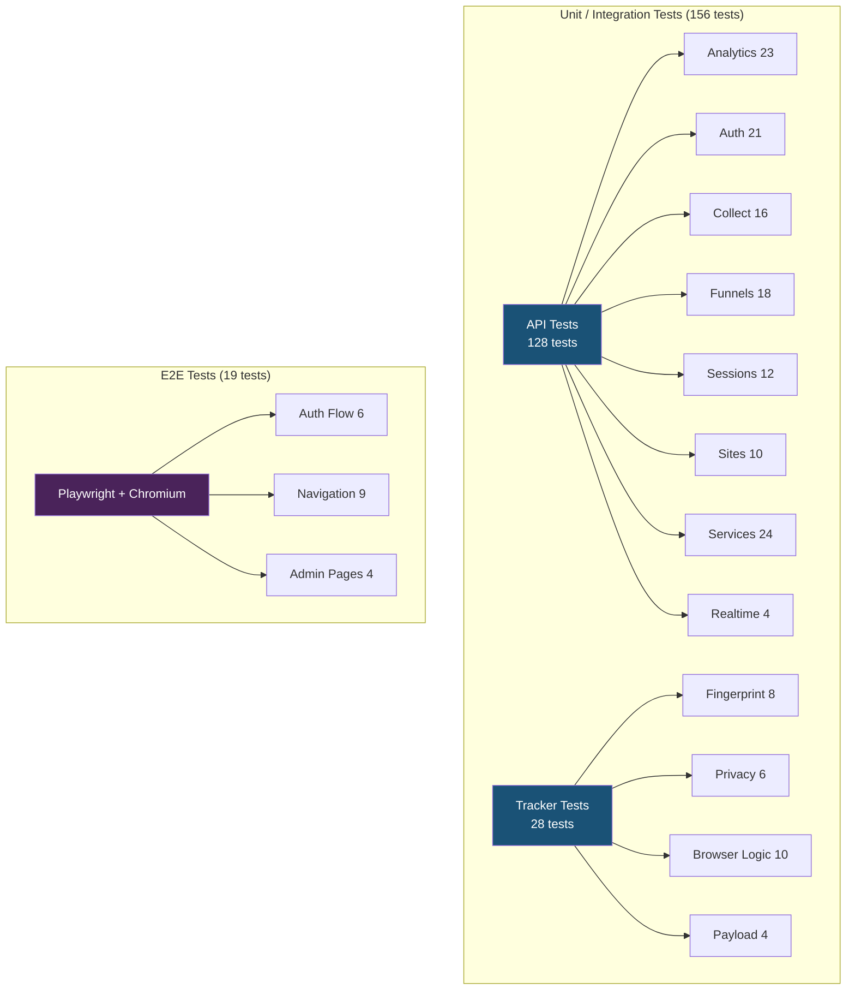

# รายงานสรุป Test Suite — Phantom Analytics

**เวอร์ชัน:** 1.2.0
**วันที่:** 27 มีนาคม 2569
**จัดทำโดย:** ทีมพัฒนา Phantom Analytics

---

## สรุปผลภาพรวม

```
╔══════════════════════════════════════════════════════╗
║   ผลการทดสอบ:  ✅ ผ่านทั้งหมด 175/175 tests        ║
║   ระยะเวลา:    Unit ~5 วินาที  |  E2E ~1 นาที      ║
╚══════════════════════════════════════════════════════╝
```

| ประเภท | จำนวน Tests | สถานะ |
|--------|-----------|-------|
| Unit/Integration Tests (API) | 128 | ✅ ผ่านทั้งหมด |
| Unit Tests (Tracker Script) | 28 | ✅ ผ่านทั้งหมด |
| E2E Tests (Dashboard UI) | 19 | ✅ ผ่านทั้งหมด |
| **รวมทั้งหมด** | **175** | **✅ 100%** |

---

## ความครอบคลุมของการทดสอบ

### 1. API Backend — 128 Tests

```
Analytics API ████████████████████ 23 tests
  ├── ภาพรวม (overview)          — KPI, period-over-period, timezone
  ├── กราฟแนวโน้ม (timeseries)   — รายชั่วโมง/รายวัน, zero-fill
  ├── หน้าเว็บ (pages)           — จัดอันดับ, sparkline
  ├── แหล่งที่มา (sources)       — direct/organic/social/referral
  ├── อุปกรณ์ (devices)          — device/browser/OS breakdown
  ├── ภูมิศาสตร์ (geo)           — ประเทศ, ชื่อประเทศ
  └── การควบคุมสิทธิ์            — auth, role-based access

Authentication  ████████████████████ 21 tests
  ├── เข้าสู่ระบบ (login)        — สำเร็จ/ล้มเหลว, ป้องกัน enumeration
  ├── ลงทะเบียน (register)       — admin คนแรก, ต้อง auth สำหรับคนถัดไป
  ├── Token login (magic link)   — สำเร็จ/token ไม่ถูกต้อง
  ├── ดูโปรไฟล์ (/me)            — auth required
  └── ออกจากระบบ (logout)

Event Collection ████████████████ 16 tests
  ├── Validation               — site+token, event type, payload
  ├── Bot filtering             — ตรวจจับ bot, ไม่บันทึกข้อมูล
  ├── Enrichment pipeline       — GeoIP, UA parsing, buffer, pub/sub
  ├── Event types               — pageview, event, session_end, scroll, click
  └── Graceful failure          — buffer fail → ยังตอบ 202

Funnels CRUD    ████████████████ 18 tests
  ├── สร้าง/ดู/แก้ไข/ลบ         — CRUD ครบ
  ├── Validation               — 2-10 steps, site ต้องมีอยู่
  └── Role-based               — viewer ไม่สามารถสร้าง/ลบ

Sessions        ████████████ 12 tests
  ├── รายการ session            — pagination, date range
  ├── Bounce detection          — is_bounce flag
  ├── Journey events            — ลำดับเวลาถูกต้อง
  └── Access control            — auth + site access

Sites CRUD      ██████████ 10 tests
  ├── สร้าง/ดู/ลบ               — CRUD + soft delete
  ├── Validation               — domain ซ้ำ → 409
  └── Auth required

Services        ██████████████████████ 24 tests
  ├── Redis Buffer              — push, null fields, custom properties
  ├── GeoIP Lookup              — valid IP, private IP, invalid, never throws
  ├── UA Parsing                — Chrome/Firefox/mobile/tablet/bot
  └── Site Access               — admin=all, viewer=assigned only

Realtime (SSE)  ████ 4 tests
  └── Auth, validation, access control

```

### 2. Tracker Script — 28 Tests

```
Fingerprint     ████████ 8 tests
  ├── Deterministic             — input เดิม = hash เดิม
  └── Entropy                   — screen/language/timezone ต่าง = hash ต่าง

Privacy         ██████ 6 tests
  ├── DNT detection             — เคารพ Do Not Track
  └── Session timeout           — 30 นาทีไม่ใช้งาน = session ใหม่

Browser Logic   ██████████ 10 tests
  ├── Offline queue             — เก็บสูงสุด 50 events, drain เมื่อออนไลน์
  ├── Scroll depth              — คำนวณ 0-100% ถูกต้อง
  └── Config override           — รองรับ __phantom_config

Payload         ████ 4 tests
  └── โครงสร้าง payload          — pageview, session_end, custom event
```

### 3. Dashboard E2E — 19 Tests

```
Auth Flow       ██████ 6 tests
  ├── หน้า login แสดงถูกต้อง
  ├── Redirect เมื่อไม่ login
  ├── แสดง error เมื่อ credentials ผิด
  ├── Login สำเร็จ
  ├── Session คงอยู่หลัง refresh
  └── Logout กลับหน้า login

Navigation      █████████ 9 tests
  ├── Sidebar แสดง menu ครบ
  ├── ทุกหน้าเปิดได้ไม่ crash
  │   (overview, pages, engagement,
  │    sources, funnels, journeys, settings)
  └── วน render ทุกหน้ารวด — ไม่มีจอขาว

Admin Pages     ████ 4 tests
  ├── Settings แสดงข้อมูล site
  ├── Funnels page เปิดได้
  ├── Activity Log (admin only)
  └── User Management (admin only)
```

---

## Diagram — Test Architecture



---

## วิธีรันการทดสอบ

| คำสั่ง | ทดสอบอะไร | ใช้เวลา | ต้องการ Docker |
|--------|-----------|---------|---------------|
| `pnpm test` | Unit tests ทั้งหมด (156 tests) | ~5 วินาที | ไม่ต้อง |
| `pnpm --filter dashboard test:e2e` | E2E ผ่าน browser จริง (19 tests) | ~1 นาที | ต้อง |

---

## สิ่งที่ยังไม่ครอบคลุม (แผนอนาคต)

| รายการ | ลำดับความสำคัญ | หมายเหตุ |
|--------|---------------|----------|
| Integration tests กับฐานข้อมูลจริง | ปานกลาง | ตอนนี้ใช้ mock ทั้งหมด |
| Load/Performance tests (/api/collect) | ต่ำ | เป้าหมาย: p99 < 50ms |
| Dashboard component unit tests | ต่ำ | E2E ครอบคลุม user journey หลักแล้ว |

---

*เอกสารนี้สร้างอัตโนมัติจากผลการทดสอบจริง — ทุก test ผ่าน 100% ณ วันที่จัดทำ*
